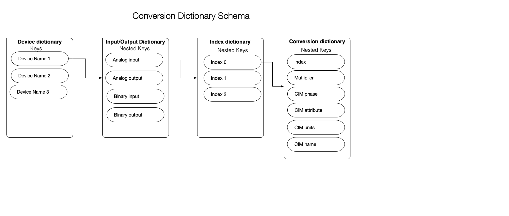
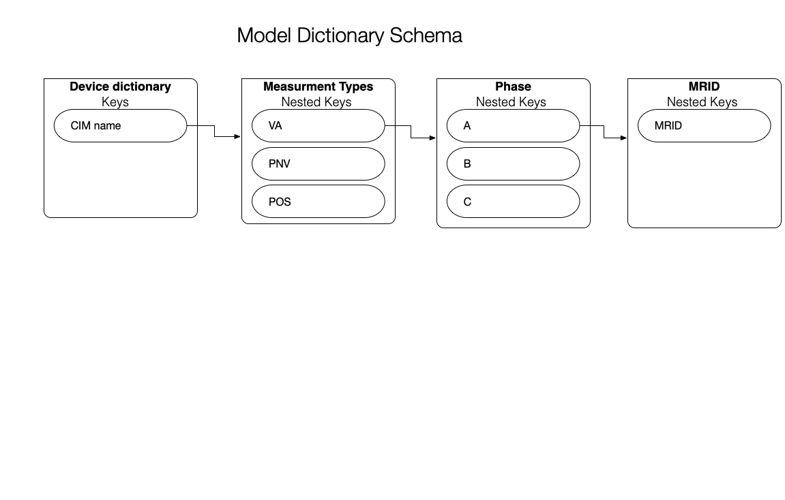
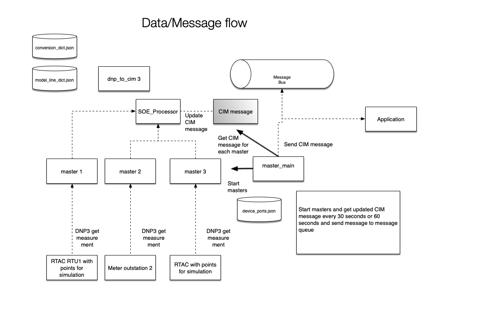
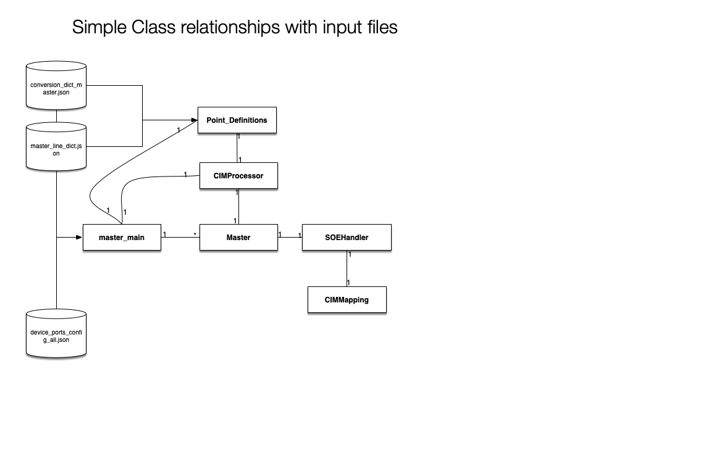

GridAPPS-D DNP3 master is an application service to integrate GridAPPS-D

DNP3 processing for Use Case 3

This paper covers the work documentation and work done for connecting to DNP3 outstation devices and converting their signals to CIM messages for use with an application built for the GridAPPS-D platform. *Mention OpenDNP3*

Current Issues TODO-WIP
^^^^^^^^^^^^^^^^^^^^^^^

#. Merge the conversion dictionaries to one conversion dictionary.
#.	Move script and function for master_main script to a class.
#.	Convert to run as a service.

   #. Code interface to provide config json files
   #. Viz to provide config json files.
   #. Ports and IP address will have to be visible.

Setup
^^^^^

There are 2 steps for getting started with creating the conversion files for DNP3 processing. This can take some time and should be considered and iterative process.
1.	Get input help from domain experts about the lab setup for the Data Manager (SEL RTAC) and equipment that into the DNP xlsx files. There is no script template or scheme for these files at the moment.
2.	Preprocessing convert the feeder model to CIM and load in the blazegraph DB, then use GridAPPS-D to create the model_dict.json

Convert files with build_conversion_dicts.py or the Jupyter notebook. This will build the json dictionary files for converting to CIM messages.

File descriptions

+-------------------------------------------------+-------------------------------------------------------------------------------------------------------------------------------------------------------------------------------------------------------------------------------------+
| File                                            | Description                                                                                                                                                                                                                         |
+=================================================+=====================================================================================================================================================================================================================================+
| DNP3_Dict_Feb23(3).xlsx- (DNP3-RTAC-list.xlsx)  | Excel file with a sheet for each RTU that has the OpenDSS load name, phase and DNP3 Analog Input index. RTU1 has the LTC, PV names and DNP3 index as Analog Output index.  RTU1 also has Binary Input and Output for the Capbanks.  |
+-------------------------------------------------+-------------------------------------------------------------------------------------------------------------------------------------------------------------------------------------------------------------------------------------+
| DNP3List.xlsx                                   | Excel file with a sheet for each piece of equipment DNP 3 details. There are fields to match with CIM values such as magnitude, angle, or position                                                                                  |
+-------------------------------------------------+-------------------------------------------------------------------------------------------------------------------------------------------------------------------------------------------------------------------------------------+
| model_dict.json                                 | The model_dict.json which has the element names and CIM MRIDS. This is generated from the CIM feeder model.                                                                                                                         |
+-------------------------------------------------+-------------------------------------------------------------------------------------------------------------------------------------------------------------------------------------------------------------------------------------+
| device_ip_port_config_all.json                  | The IP address, port number, and DNP3 address for each piece of equipment and RTU.                                                                                                                                                  |
+-------------------------------------------------+-------------------------------------------------------------------------------------------------------------------------------------------------------------------------------------------------------------------------------------+

The conversion dictionary files are

+------------------------------+-----------------------------------------------------------------------------------+
| Files                        | Description                                                                       |
+==============================+===================================================================================+
| conversion_dict_eq.json      | Dictionary of DNP3 device to DNP3 data type input/output to DNP3 index to object  |
+------------------------------+-----------------------------------------------------------------------------------+
| conversion_dict_master.json  | Dictionary of DNP3 device to DNP3 data type input/output to DNP3 index to object  |
+------------------------------+-----------------------------------------------------------------------------------+
| model_line_dict_master.json  | Dictionary of OpenDSS names to CIM type to Phase to MRID                          |
+------------------------------+-----------------------------------------------------------------------------------+

Example of the RTU7 entry in conversion_dict_master.json:

.. code-block:: JSON

    {
      "key": "value"
    }

.. code-block:: JSON
    :caption: Conversion Dict Example

    {
        "RTU_7": {
           "Analog input": {
             "0": {
               "DSS to OdeepC Meter Point": "P_Tran_xf_701_1095507_5022.1",
               "Measurement": "Real Power",
               "DSS Marker": 11.0,
               "RTAC RTU Address": 1.0,
               "Analog In Index": 0,
               "RTU port": 20007,
               "RTAC IP": "10.79.91.42",
               "Multiplier": "",
               "index": 0,
               "CIM phase": "A",
               "CIM attribute": "magnitude",
               "CIM units": "VA",
               "CIM name": "tran_xf_701_1095507_5022"
             }
          }
        }
    }

Example of an entry in model_line_dict_master.json

.. code-block:: JSON
    :caption: Model Dictionary Example

    {
        "tran_xf_701_1095511_5025": {
           "VA": {
             "A": {
               "mrid": "_262c1051-d1f3-4210-8464-7fc184c65290",
               "type": "angle"
             }
           },
           "PNV": {
             "A": {
               "mrid": "_b546b42e-43b6-4efc-87eb-d3e215c86957",
               "type": "angle"
             }
           }
        }
    }

Running
^^^^^^^

Start the master_main.py with the argument for which RTU or piece of equipment to connect to. For example ‘RTU1’ or  ‘*’ for everything. The inputs at the moment are ‘RTU1’, ‘RTU2’, ‘RTU3’, ‘RTU4’, ‘RTU5’, ‘RTU6’, ‘shark 1’ and ‘shark 2’. The master_main.py will start one or more DNP3 masters and run until you kill the process. It will also save a csv file for every input.

.. code-block:: BASH
    :caption: master_main example

    python master_main.py ‘*’

Classes and scripts
^^^^^^^^^^^^^^^^^^^

build_conversion_dicts.py
build_RTAC function
Description: The build_conversion_dicts.py builds the conversion dictionaries used to convert DNP3 message to CIM messages.

+--------------------------+--------------------------------------------------------------------------------------------------------------+
| Parameter                | Description                                                                                                  |
+==========================+==============================================================================================================+
| DNP3_Dict_Feb23(3).xlsx  | Excel file with a sheet for each RTU.                                                                        |
+--------------------------+--------------------------------------------------------------------------------------------------------------+
| DNP3List.xlsx            | Excel file with a sheet for each piece of equipment DNP 3 details                                            |
+--------------------------+--------------------------------------------------------------------------------------------------------------+
| model_dict.json          | The model_dict.json which has the element names and CIM MRIDS. This is generated from the CIM feeder model.  |
+--------------------------+--------------------------------------------------------------------------------------------------------------+

Master class in master.py
Class to connect to DNP3 outstations. Actual processing of messages is done by a SOEHandler.

Constructor
Description:
Initialize connection to DNP3 outstations

+-------------+-------------------------------------------------+
| Parameters  | Description                                     |
+=============+=================================================+
| HOST        | Host IP address                                 |
+-------------+-------------------------------------------------+
| LOCAL       | DNP3 local IP address                           |
+-------------+-------------------------------------------------+
| PORT        | DNP3 Port                                       |
+-------------+-------------------------------------------------+
| DNP3_ADDR   | DNP3 Address                                    |
+-------------+-------------------------------------------------+
| LocalAddr   | Local Addr                                      |
+-------------+-------------------------------------------------+
| soe_handler | SOE handler class that handles processes DNP3   |
+-------------+-------------------------------------------------+

SOEHandler class in master.py
The SOEHandler class handles DNP3 values received from the outstation.
It is an interface for SequenceOfEvents (SOE) callbacks from the Master stack to the application layer. Note add link.

Constructor
Description: Class that handles updates to DNP3 values

+-------------+-------------------+
| Parameters  | Description       |
+=============+===================+
| name        | name              |
+-------------+-------------------+
| device      | DNP3 device name  |
+-------------+-------------------+
| dnp3_to_cim | CIMMapping class  |
+-------------+-------------------+

process method
Description:
Use the dnp3_to_cim to maps to create the CIM message for DNP3 values
Loop through values

+-------------+-----------------------------------------------------------------------------------------+
| Parameters  | Description                                                                             |
+=============+=========================================================================================+
| info        |                                                                                         |
+-------------+-----------------------------------------------------------------------------------------+
| values      | A collection of values received from the Outstation (various data types are possible).  |
+-------------+-----------------------------------------------------------------------------------------+

Input Classes

+---------------+-----------------+--------+------------+-----------------------------------------------------------------------------+
| Type          | OpenDNP3 Class  | Group  | Variation  | Link                                                                        |
+===============+=================+========+============+=============================================================================+
| Cap           | opendnp3.Binary | 1*     | 2*         | https://dnp3.github.io/docs/cpp/3.0.0/db/dcf/classopendnp3_1_1_binary.html  |
+---------------+-----------------+--------+------------+-----------------------------------------------------------------------------+
| PV            | opendnp3.Analog | 30*    | 1*         | https://dnp3.github.io/docs/cpp/3.0.0/dc/dd8/classopendnp3_1_1_analog.html  |
+---------------+-----------------+--------+------------+-----------------------------------------------------------------------------+
| Load Power    | opendnp3.Analog | 30*    | 1*         | https://dnp3.github.io/docs/cpp/3.0.0/dc/dd8/classopendnp3_1_1_analog.html  |
+---------------+-----------------+--------+------------+-----------------------------------------------------------------------------+
| Load Voltage  | opendnp3.Analog | 30*    | 1*         | https://dnp3.github.io/docs/cpp/3.0.0/dc/dd8/classopendnp3_1_1_analog.html  |
+---------------+-----------------+--------+------------+-----------------------------------------------------------------------------+
| Shark         | opendnp3.Analog | 30*    | 1*         | https://dnp3.github.io/docs/cpp/3.0.0/dc/dd8/classopendnp3_1_1_analog.html  |
+---------------+-----------------+--------+------------+-----------------------------------------------------------------------------+
| Reg           | opendnp3.Analog | 30*    | 1*         | https://dnp3.github.io/docs/cpp/3.0.0/dc/dd8/classopendnp3_1_1_analog.html  |
+---------------+-----------------+--------+------------+-----------------------------------------------------------------------------+

CIMMapping class in dnp3_to_cim.py
Holds dictionaries for mapping

Constructor
Description:
Set dictionary values.

+------------------+-----------------------+
| Parameters       | Description           |
+==================+=======================+
| conversion_dict  | Conversion_dict file  |
+------------------+-----------------------+
| model_line_dict  | Model_line_dict file  |
+------------------+-----------------------+

master_main.py script
main function
Description:
Read list of device names from command line and call run_masters.

run_masters function
Description:

#. Create masters using the name in the names list to get the IP, PORT, DNP3 addr etc... in  device_ip_port_config_all.json. Also pass the dnp3_to_cim mapping dictionaries for conversion_dict_master.json and model_line_dict_master.json to each master.
#. Initialize cim_full_msg dictionary with the basics of a CIM message
#. While loop for getting CIM messages

   #. For each master get the converted CIM messages and update the cim_full_msg.
   #. Send the cim_full_msg to the application.
   #. Write data to cvs file for each master.
   #. Sleeps for 60 seconds

+----------------------------+-------------------------------+
| Parameters                 | Description                   |
+============================+===============================+
| device_ip_port_config_all  | CIM message from application  |
+----------------------------+-------------------------------+
| names                      | List of DNP3 Master names     |
+----------------------------+-------------------------------+

on_message function
Description:
Use the CIMProcessor to process the command from the application

+-------------+-------------------------------+
| Parameters  | Description                   |
+=============+===============================+
| message     | CIM message from application  |
+-------------+-------------------------------+

CIMProcessor class in CIMProcessor.py
Description:
CIMProcessor handles commands from the application and sends the values to the outstation through the master.
At the moment there are regulator, capacitor and a pv list of point definitions.
Constructor

+---------------------+----------------------------------------------------------------------------------------------------------------------+
| Parameters          | Description                                                                                                          |
+=====================+======================================================================================================================+
| point_definitions  | Point definition which is just the PV point definitions                                                               |
+---------------------+----------------------------------------------------------------------------------------------------------------------+
| master              | The DNP3 master used to send commands. For Use Case 3 there was only one master RTU1 used to send all the commands.  |
+---------------------+----------------------------------------------------------------------------------------------------------------------+

process method
Description:

.. code-block::
    :caption: Pseudo code for processing

    Get the control_values from the messages.
    Pseudo code for processing control input commands from message:
    For command in control_values:
        For point in point_list:
            If command.get("object") == point.measurement_id:
                point.value = command.get("value")
                                           master.send_direct_operate_command(point.value,
                                                                                            temp_index,
                                                                            command_callback)

+-------------+----------------------------------------------------------------------------------------------------------------------+
| Parameters  | Description                                                                                                          |
+=============+======================================================================================================================+
| message     | Message from GOSS message bus                                                                                        |
+-------------+----------------------------------------------------------------------------------------------------------------------+
| master      | The DNP3 master used to send commands. For Use Case 3 there was only one master RTU1 used to send all the commands.  |
+-------------+----------------------------------------------------------------------------------------------------------------------+

Output Classes

+-------+------------------------------------------------------------------------------------------------------+--------+------------+-------------------------------------------------------------------------------------------------+
| Type  | OpenDNP3 Class                                                                                       | Group  | Variation  | Link                                                                                            |
+=======+======================================================================================================+========+============+=================================================================================================+
| Cap   | opendnp3.ControlRelayOutputBlock(opendnp3.ControlCode.LATCH_ON or opendnp3.ControlCode.LATCH_OFF)    | 12*    | 1*         | https://dnp3.github.io/docs/cpp/3.0.0/d4/d3c/classopendnp3_1_1_control_relay_output_block.html  |
+-------+------------------------------------------------------------------------------------------------------+--------+------------+-------------------------------------------------------------------------------------------------+
| PV    |  opendnp3.AnalogOutputInt32()                                                                        | 41     | 1          | https://dnp3.github.io/docs/cpp/3.0.0/de/d53/classopendnp3_1_1_analog_output_int32.html         |
+-------+------------------------------------------------------------------------------------------------------+--------+------------+-------------------------------------------------------------------------------------------------+
| Reg   | opendnp3.AnalogOutputInt32()                                                                         | 41     | 1          | https://dnp3.github.io/docs/cpp/3.0.0/de/d53/classopendnp3_1_1_analog_output_int32.html         |
+-------+------------------------------------------------------------------------------------------------------+--------+------------+-------------------------------------------------------------------------------------------------+

Class Diagram and Message Flow
^^^^^^^^^^^^^^^^^^^^^^^^^^^^^^

